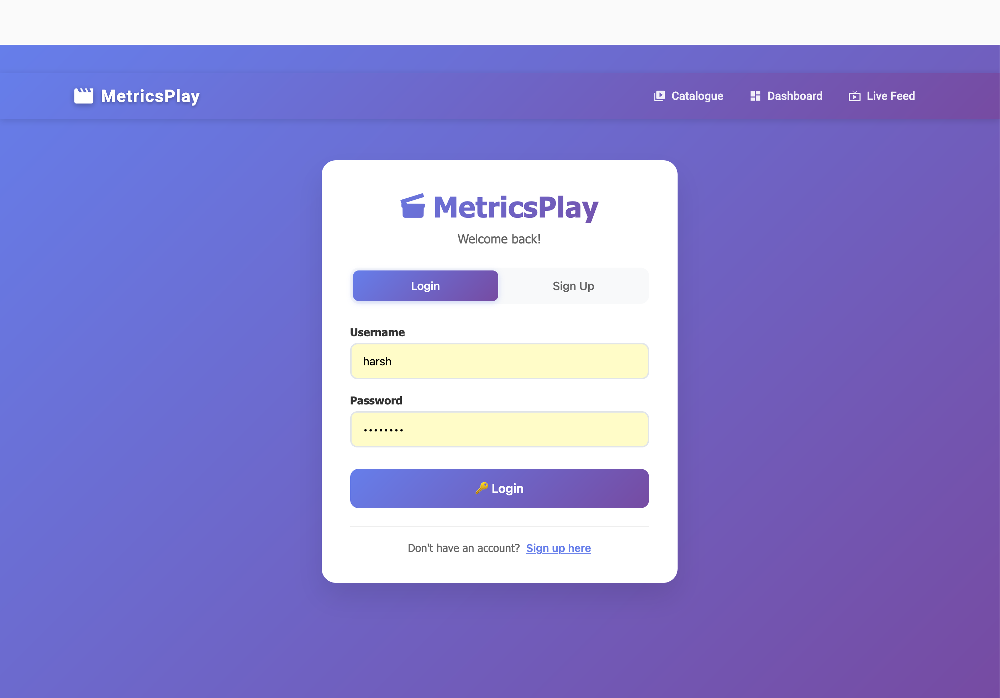

# Metrics Play

Real-time analytics platform for streaming with Spring Boot, Kafka, PostgreSQL, Redis, and Angular — fully containerized with Docker Compose.

## Overview
Metrics Play provides:
- JWT-secured REST APIs for authentication and catalog/streaming
- Real-time event processing over Kafka (e.g., play/pause/seek/viewer updates)
- PostgreSQL for persistence
- Redis for fast counters/state (e.g., live viewers)
- Angular SPA with live dashboards and a video player
- WebSocket (SockJS/STOMP) for live updates

## Tech Stack
- Backend: Spring Boot 3, Spring Security (JWT), Spring Data JPA, Spring for Kafka, WebSocket (SockJS/STOMP)
- Frontend: Angular, Angular Material
- Data: PostgreSQL, Redis
- Streaming/Events: Apache Kafka, Zookeeper
- Tooling: Docker Compose, Kafka UI, pgAdmin

## Repository Structure
```
MetricsPlay/
├─ backend/                 # Spring Boot app
│  ├─ src/main/java/com/harsh/metricsPlay
│  ├─ src/main/resources
│  └─ pom.xml
├─ frontend/                # Angular app
│  └─ src/app
├─ videos/                  # Sample media files
├─ docker-compose.yml       # Full stack orchestration
└─ .env                     # Environment variables (compose)
```

## Services & Ports
- Backend (Spring Boot): http://localhost:8080
- Frontend (Angular dev server): http://localhost:4200
- PostgreSQL: localhost:5432
- pgAdmin: http://localhost:5050
- Kafka broker: localhost:9092
- Kafka UI: http://localhost:8081
- Redis: localhost:6379

## Quick Start (Docker Compose) for local run
1. Ensure Docker Desktop is running
2. Review `.env` in the repo root (already provided). Key entries:
   - `POSTGRES_USER`, `POSTGRES_PASSWORD`, `POSTGRES_DB`
   - `JWT_SECRET`, `JWT_EXPIRATION`
   - `SPRING_DATASOURCE_URL`, `SPRING_DATASOURCE_USERNAME`, `SPRING_DATASOURCE_PASSWORD`
   - `KAFKA_*`, `SPRING_REDIS_*`
3. Start the stack:
   - macOS/Linux: `docker compose up -d`
4. Open:
   - Frontend: http://localhost:4200
   - API: http://localhost:8080
   - Kafka UI: http://localhost:8081
   - pgAdmin: http://localhost:5050

To stop: `docker compose down`

## Backend (Spring Boot)
- Base URL: `http://localhost:8080`
- Auth:
  - `POST /api/auth/signup` → `{ username, password }` → `{ token }`
  - `POST /api/auth/login`  → `{ username, password }` → `{ token }`
- Films:
  - `GET /api/films` → list
  - `GET /api/films/{id}` → details
  - `GET /api/films/{id}/stream` → video stream (requires JWT)
- Viewers:
  - `GET /api/viewers/film/{filmId}/count` → current viewer count
- WebSocket (SockJS/STOMP): `/ws`
- Send `Authorization: Bearer <JWT>` header for all protected endpoints

Security configuration (`SecurityConfig`) permits `/api/auth/**` and secures other endpoints with JWT. A `JwtAuthFilter` extracts and validates bearer tokens.

## Frontend (Angular)
- Dev server runs in Docker at http://localhost:4200 (compose executes `npm install && npm start`)
- HTTP interceptor is registered in `app.config.ts` to add the JWT to outgoing HttpClient requests.

You may need a `proxy.conf.json` to route `/api` to `http://localhost:8080` during local dev.

## Kafka
Kafka powers the real-time event pipeline for playback events and live viewer analytics.

- Purpose
  - Transport video player events (play, pause, seek, progress, ended) from API to analytics
  - Decouple event ingestion from real-time processing and dashboards

- Topics (created via `KafkaConfig` @Bean NewTopic)
  - `video-events` (3 partitions, 1 replica): primary stream of player events
  - `real-time-analytics` (3 partitions, 1 replica): derived stream for broadcasting analytics

- Producer (backend)
  - Class: `EventProducerService`
  - Method: `sendVideoEvent(event)` publishes to `video-events`
  - Key: `userId_filmId_sessionId` for better partition locality
  - Serializer: JSON (`JsonSerializer`)

- Consumer (backend)
  - Class: `EventConsumerService`,`LiveEventService`
  - Listener: `@KafkaListener(topics = video-events, groupId = video-events-processor)`
  - Routes by `eventType` to `RealTimeAnalyticsService`:
    - `handlePlayEvent`
    - `handlePauseEvent`
    - `handleProgressEvent`
    - `handleEndedEvent`

- Observability
  - Kafka UI (Docker): http://localhost:8081
    - Inspect topics, messages, partitions, consumer groups, lag

## Database & Admin
- PostgreSQL is pre-provisioned via `.env`
- pgAdmin is available at http://localhost:5050 (credentials from `.env`)
- JPA/Hibernate manage schema at startup based on entities

## Redis
Redis is used for fast, real-time state storage, primarily to track concurrent viewers per film.

- Purpose
  - Maintain a live count of current viewers per film without hitting the database
  - Power live dashboards and in-player viewer counts via WebSocket broadcasts

- Keys & Data Structures
  - Key pattern: `concurrent_viewers:{filmId}`
  - Type: Redis Set
  - Member stored: `userId` (one presence per user per film)
  - TTL: 5 minutes; refreshed on activity

## Environment Variables (reference)
See `.env` in the repo root for all values used by `docker-compose.yml`, including:
- Database: `POSTGRES_USER`, `POSTGRES_PASSWORD`, `POSTGRES_DB`
- JWT: `JWT_SECRET`, `JWT_EXPIRATION`
- Spring Datasource: `SPRING_DATASOURCE_URL`, `SPRING_DATASOURCE_USERNAME`, `SPRING_DATASOURCE_PASSWORD`
- Kafka: `KAFKA_BROKER_ID`, `KAFKA_ADVERTISED_LISTENERS`, `KAFKA_OFFSETS_TOPIC_REPLICATION_FACTOR`, `KAFKA_BOOTSTRAP_SERVERS`
- Redis: `SPRING_REDIS_HOST`, `SPRING_REDIS_PORT`

## Screenshots

### Login Page


### Sign Up Page


### Catalogue


### Live Feed
Consumes Events from Kafka - frontend consumes from websocket


### Dashboard


### Video Player
tracks play|pause|progress|seek|end


### Live Viewer Count
updates live count from redis cache via websocket
